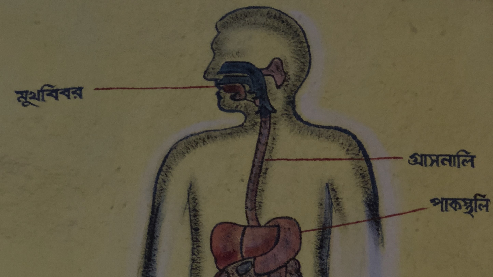
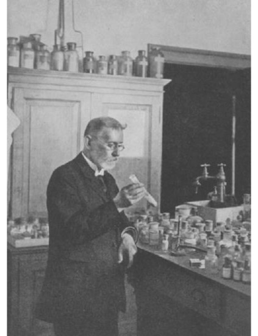
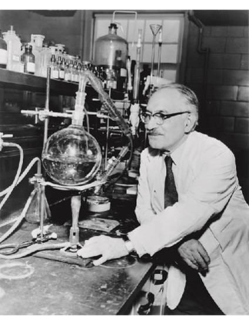
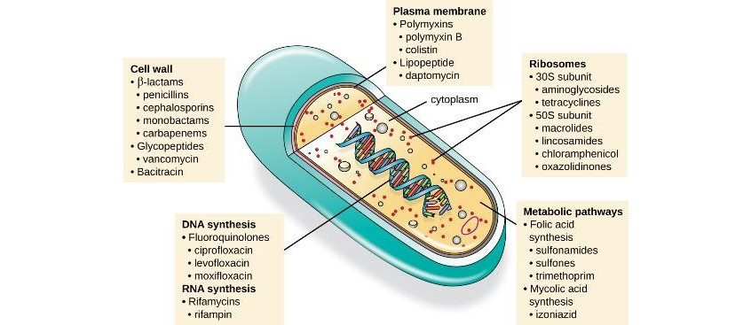

<!-- _paginate: false -->

# Chapter 14 Antimicrobial Drugs 💊

##### Justin N. Howard
Campbellsville University

Summer 2024

<!-- _footer: open**stax** _Microbiology_ -->

---

<!-- _paginate: false -->
# Outline
14.1 A short history lesson
14.2 Fundamentals
14.3 Mechanisms

---
<!-- _paginate: false -->

#### Key Terms
- bacteriostatic
- bactericidal
- narrow spectrum
- broad-spectrum
- superinfection
- half-life
- drug resistance
- multidrug-resistant microbes (MDRs)
- methicillin-resistant _S. aureus_ (MRSA)
- vancomycin-resistant enterococci (VRE)
- carbapenem-resistant enterobacteria (CRE)
---
<!-- _paginate: false -->
<!-- _class: invert -->

# 14.1 The History of Chemotherapy and Antimicrobial Discovery

---
<!-- _paginate: false -->
<!-- _class: invert -->
# **Ayurveda** means 'the knowledge of life' or 'the science of life’.

- ## Oldest form of healthcare in the world, discovered in ancient Hindu scriptures called the **Vedas**
- ## Over 5000 years old 
- ## Theory of Bio-energies and yoga are rooted in these ideas

---

# For millennia, Chinese herbalists have used many different species of plants for the treatment of a wide variety of human ailments. Chinese – Traditional Chinese medicines – a great herbal system.
- ## Shen Nong compiled list of 365 herbal drugs in 2000 BC
- ## Acupuncture, tai chi, Yin and Yang

---
# Year: 1909

#####  **Paul Ehrlich** made an important discovery with compound 606, an antimicrobial agent that proved to be an effective treatment for syphilis.
- ##### He synthesized Salvarsan containing arsenic in **1909**
- #### Abandoned in the 1940’s because powder form was unstable and hard to administer
- ##### His method was important, testing over 600 compounds
  
---

# Year: 1928
# **Alexander Fleming** was the first to discover a naturally produced antibiotic, **penicillin**.

- ## Returned to work after vacation and looked some old plates of staphylococci
- ## The mold _Penicillium notatum_ had started to grow on the plates, and inhibited the staphylococcal growth.

---

# Year: 1939

# German researchers won the Nobel prize in 1939 for  discovering that a dye cured streptococcal and staphylococcal infections.

# This led to Sulfanilamide, the precursor to class of sulfa drugs, and the **first synthetic antimicrobial agent.**

---

# Year: 1940's

- # Penicillin is purified
- # Efficacy tested in animal and human trials 
- # After crystallography was used to determine structure, **semisynthetic** antimicrobial drugs were born.

---

# Year: cir. 1950's

## Selman Waksman was the first to show the vast antimicrobial production capabilities of a group of **soil bacteria**, Actinobacteria.

## Bacteria in soil, specifically genus **_Streptomyces_** are source for *_half of all natural ABT's._*

---
<!-- _paginate: false -->
# 14.2 Fundamentals

---

# Routes of Administration

---

# **Bacteriostatic Drugs** cause reversible inhibition of bacterial growth. 
- ## Growth resumes after drug elimination)

# **Bactericidal drugs** kill target bacteria.
- ## Important for immunocompromised patients
- ## Required for life-threatening infections (e.g., acute endocarditis)

---

# Narrow-Spectrum Antimicrobials

- ## Target specific subsets of bacteria (e.g., only gram-positive or gram-negative)
- ## **Used when the pathogen is identified**, minimizing collateral damage to normal microbiota
  
---

# Broad-Spectrum Antimicrobials

- ## Target a wide variety of bacteria (both gram-positive and gram-negative)
- ## **Used as empiric therapy** before pathogen identification
- ## Suitable for polymicrobic infections and prophylactic prevention

---

# Superinfection Risk

- ## Broad-spectrum antimicrobials can disrupt normal microbiota
- ## May lead to secondary infections, e.g., 
  - ### yeast infections (candidiasis)
  - ### pseudomembranous colitis (caused by _Clostridium difficile_)

---
<!-- _paginate: false -->
<!-- _class: invert  -->

# 14.3 Mechanisms of Action

---
<!-- _paginate: false -->

---

| Mode of Action                     | Target                                 | Drug Class                                                       |
|------------------------------------|----------------------------------------|------------------------------------------------------------------|
| Inhibit cell wall biosynthesis     | Penicillin-binding proteins            | β-lactams: penicillins, cephalosporins, monobactams, carbapenems |
|                                    | Peptidoglycan subunits                 | Glycopeptides                                                    |
|                                    | Peptidoglycan subunit transport        | Bacitracin                                                       |
| Inhibit biosynthesis of proteins   | 30S ribosomal subunit                  | Aminoglycosides, tetracyclines                                   |
|                                    | 50S ribosomal subunit                  | Macrolides, lincosamides, chloramphenicol, oxazolidinones        |

---

| Mode of Action                     | Target                                 | Drug Class                                                       |
|------------------------------------|----------------------------------------|------------------------------------------------------------------|
| Disrupt membranes                  | Lipopolysaccharide, inner and outer membranes | Polymyxin B, colistin, daptomycin                                  |
| Inhibit nucleic acid synthesis     | RNA                                    | Rifamycin                                                        |
|                                    | DNA                                    | Fluoroquinolones                                                 |
                                     

---

| Mode of Action                     | Target                                 | Drug Class                                                       |
|------------------------------------|----------------------------------------|------------------------------------------------------------------|
| Antimetabolites                    | Folic acid synthesis enzyme            | Sulfonamides, trimethoprim                                       |
|                                    | Mycolic acid synthesis enzyme          | Isonicotinic acid hydrazide                                      |
|                                    | Mycobacterial adenosine triphosphate (ATP) synthase inhibitor | Mycobacterial ATP synthase         | Diarylquinoline               

---
Class: β-lactams
Slide 4
Examples
Penicillins: Penicillin G, Penicillin V, Ampicillin, Amoxicillin, Methicillin
Cephalosporins: Cephalosporin C, Semisynthetic cephalosporins
Monobactams: Aztreonam
Carbapenems: Imipenem, Meropenem, Doripenem

---

# Class: Avermectins (belong to macrolide)
# Examples: Ivermectin®
- Treats roundworm disease
- For humans, Ivermectin® tablets are approved at very specific doses to treat some parasitic worms
-  Topical (on the skin) formulations for head lice and skin conditions like rosacea are also available.
### MOA: Blocks neuronal transmission by binding to cell membrane gated channels common to invertebrates (e.g. lice, mites, bed bugs)

